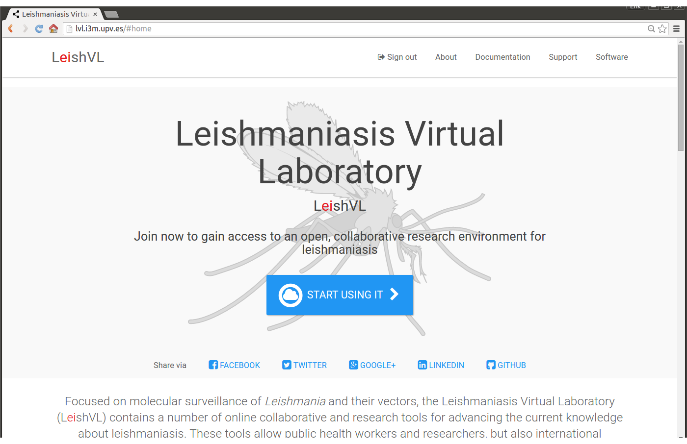
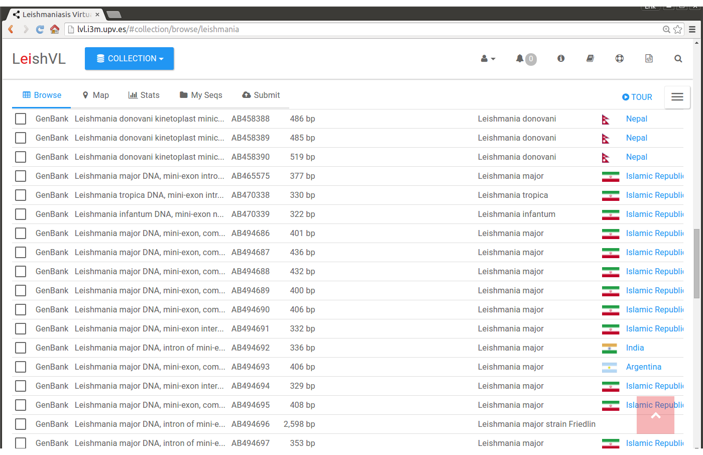
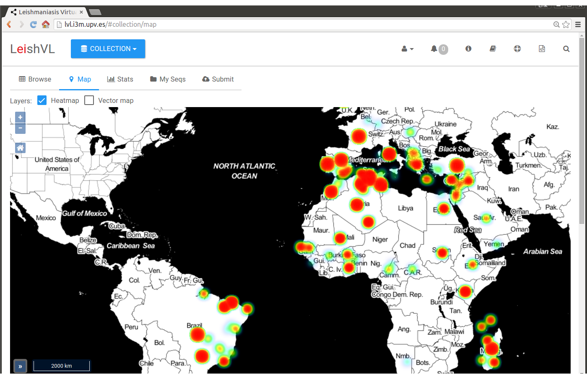

# Leishmaniasis-Virtual-Lab - [v0.9.8](http://lvl.i3m.upv.es/apidoc/)

[http://lvl.i3m.upv.es](http://lvl.i3m.upv.es) - The Leishmaniasis Virtual Laboratory: an open, collaborative environment for research in leishmaniasis.

## Master Build Status

## Screenshots

## Endpoints

* Sandbox: [http://dedalo.i3m.upv.es](http://dedalo.i3m.upv.es)
* Production: [http://lvl.i3m.upv.es](http://lvl.i3m.upv.es)

## Documentation

* [Official website development](http://dedalo.i3m.upv.es/apidoc/)
* [Official website](http://lvl.i3m.upv.es/apidoc/)

## Release History

View the complete change history at the [Change Log](CHANGELOG.md).

## Authors

The __Leishmaniasis Virtual Laboratory__ is part of the EU-Brazil Cloud Connect initiative, an intercontinental, federated e-infrastructure for scientific usage, funded by the European Commission and the MCT/CNPq of Brazil:

* [http://www.eubrazilcloudconnect.eu](http://www.eubrazilcloudconnect.eu/)
* [https://twitter.com/EUBrazilCC](https://twitter.com/EUBrazilCC)
